# Fake vs Real Voice Detection - Training Pipeline

Minimal pipeline to train a hybrid CNN-LSTM binary classifier on 2s audio clips.

Quick start

1. Create manifest CSV from your dataset root (which should contain `training/fake` and `training/real`):

```bash
python prepare_manifest.py "C:/Users/omerf/Downloads/for-2sec/for-2seconds" manifest.csv
```

2. Install dependencies (prefer a venv):

```bash
pip install -r requirements.txt
```

3. Run training:

```bash
python train.py --manifest manifest.csv --workdir ./runs --epochs 10 --batch-size 32 --save-model best.pth
```

Files

- `prepare_manifest.py`: generate `filepath,label` CSV from `training/fake` and `training/real`.
- `data_utils.py`: `AudioDataset` using torchaudio MFCCs.
- `model.py`: `CNNLSTM` model.
- `train.py`: training loop and simple validation.

Visualizations and Artifacts

The training run generates an `artifacts/` folder that contains visualizations and CSV outputs. Below are the key visualizations produced in this project:

## Audio Sample Visualizations

### Real Audio

**Waveform:**
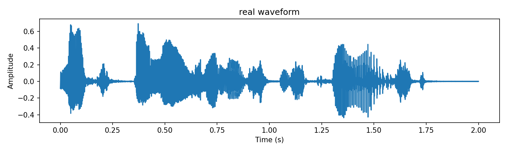

**Spectrogram:**
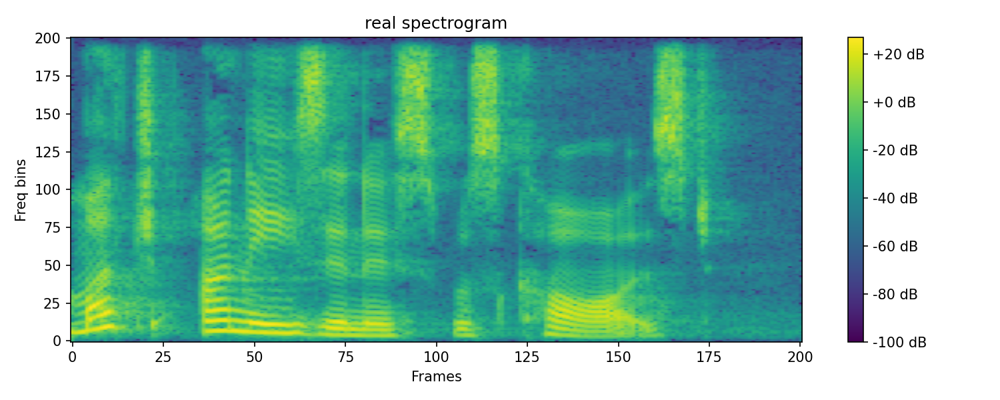

**Mel-Spectrogram:**
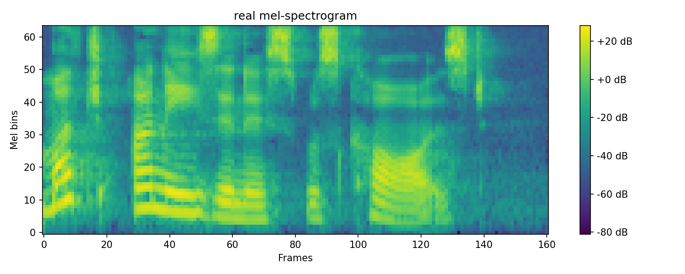

**MFCC:**
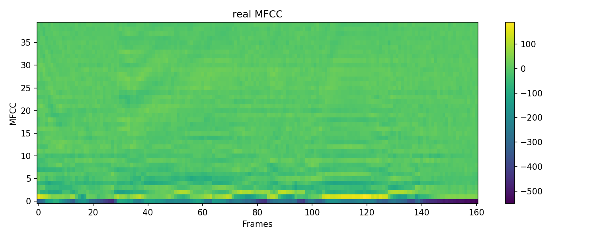

### Fake Audio

**Waveform:**
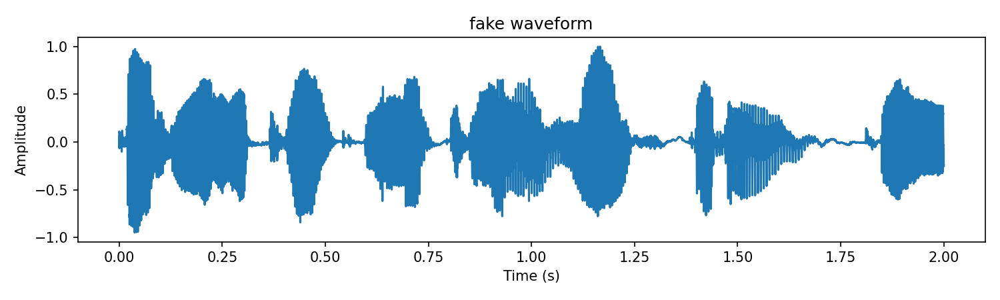

**Spectrogram:**
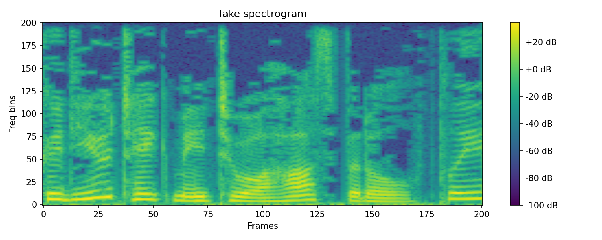

**Mel-Spectrogram:**
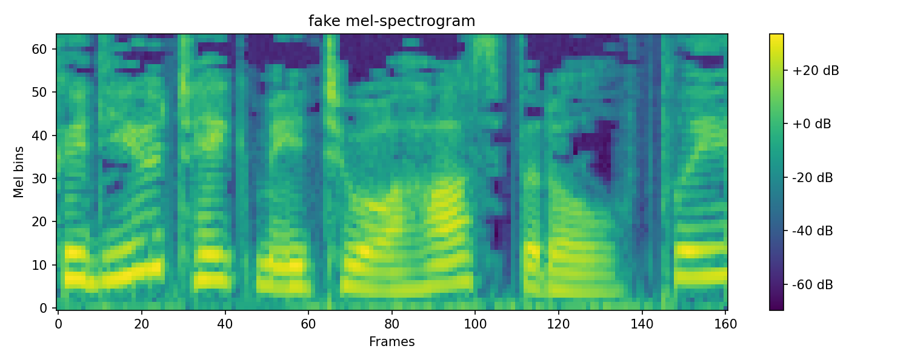

**MFCC:**
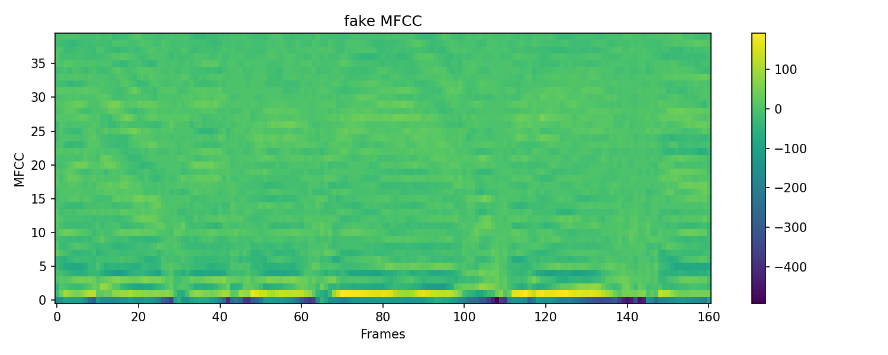

## Dataset Statistics

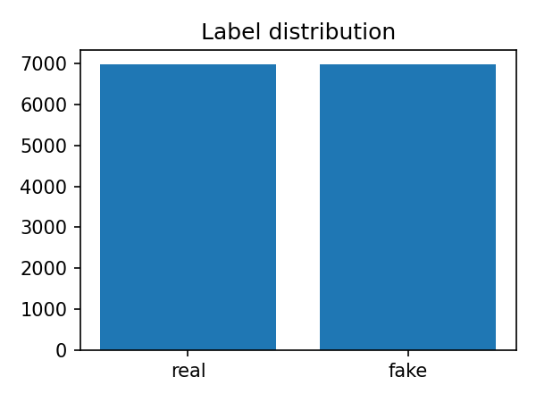

## Training Curves

**Training Loss:**
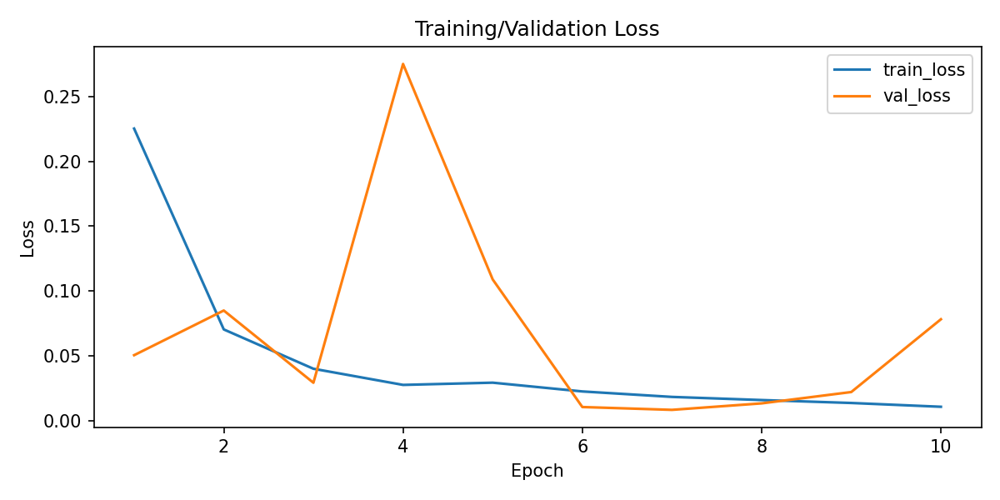

**Training Accuracy:**
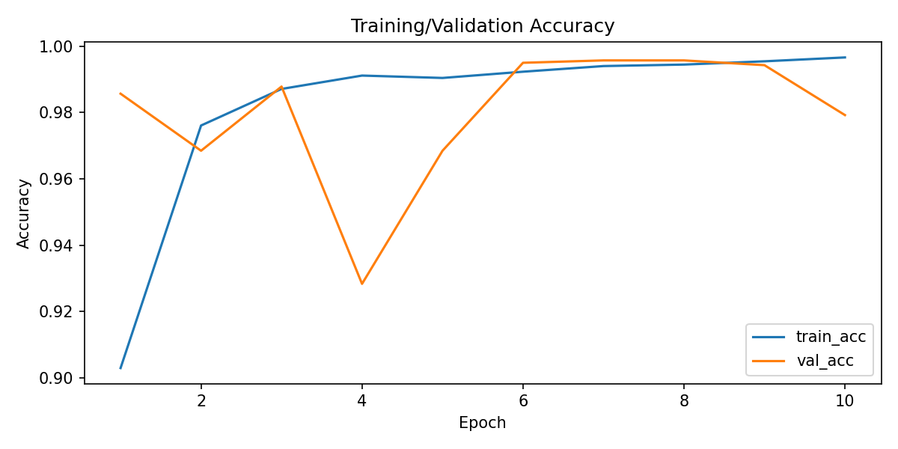

**Validation AUC:**
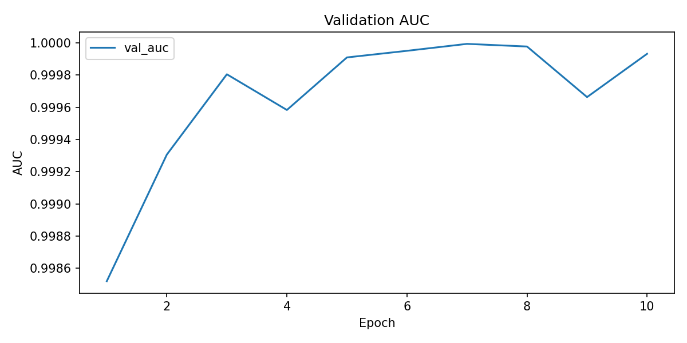

## Evaluation Metrics

**Confusion Matrix:**
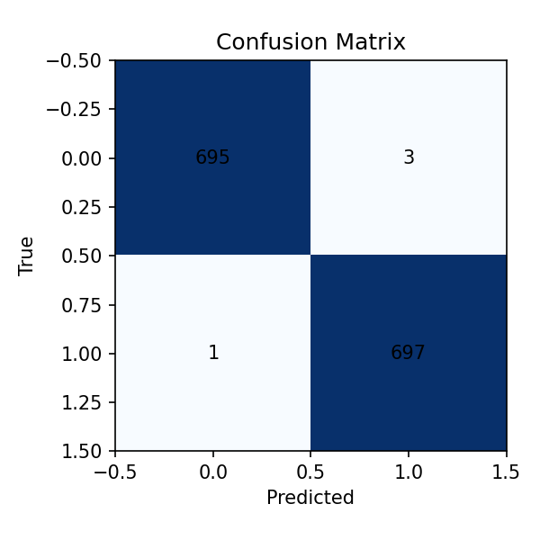

**ROC Curve:**
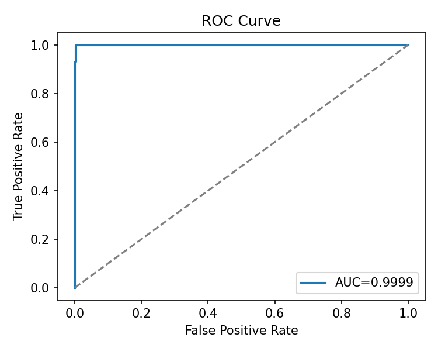

**Precision-Recall Curve:**
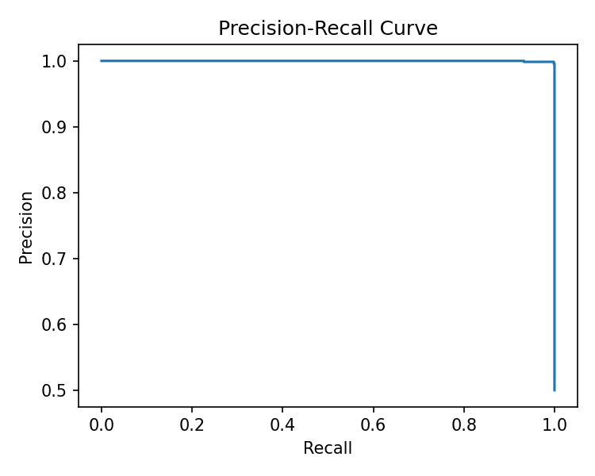

**Prediction Probability Distribution:**
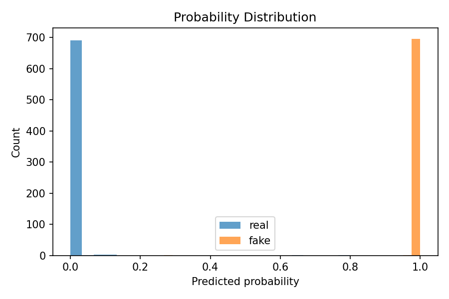

Final metrics from the most recent run included in this folder

- Test loss: 0.0084
- Test accuracy: 0.9971
- Test F1: 0.9971
- Test AUC: 0.9999

Notes and caveats

These results are reported on the dataset split used during training. High metrics can indicate good separation but may also signal dataset artifacts or leakage. Before using the model in a real setting, evaluate on out of distribution data and use source-level splits.

Next steps

- Add argument to tune MFCC and model hyperparameters.
- Add checkpointing, TensorBoard logging, and better data augmentation.
